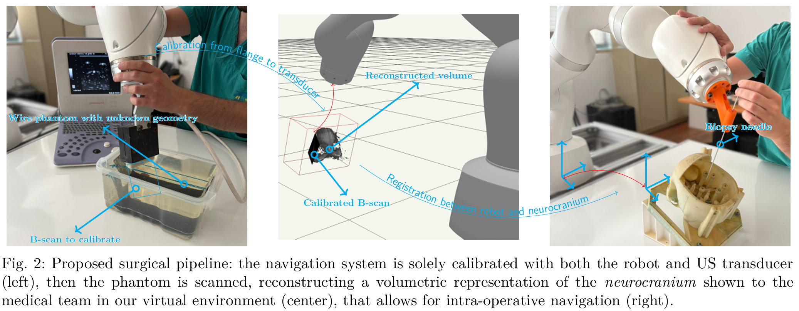

# Curan

Welcome to the Curan SDK, a framework developed to explore surgical navigation platforms with flexible-joint robots. 
At its essence Curan is a medical viewer, developed at IST, with contribution from
the contribution list and the end of the file. The library provides interfaces which
simplify the implementation of medical demos with real time
capabilities. 

## Snippets of Curan

Curan contains a broad range of functionality, ranging from registration between modalities, path planning, volumetric reconstruction, control, ultrasound-MRI registration, among others. 
The major contribution of our platform is that intra-operative navigation can be achieved solely using an ultrasound probe and the robotic arm as shown in the following figure



To facilitate the use by surgical teams, we developed all facets of the surgical procedure using our own technological stack from scratch, so as to avoid licencing problems in the future. 

Here we show some of the functionality that we provide inside Curan

Registration between modalities for planning


Calibration of ultrasound with robotic system


Volumetric reconstruction of ultrasounds for intra-operative registration


## API Reference

Curan has a [website](https://human-robotics-lab.github.io/CuranWeb/) where you can follow our tutorials on how to use the SDK we developed at the surgical robotics lab. 
**Note that this is work is progress, funding is necessary to finish documenting the entire project**

The SDK is divided into nine main modules and a tenth module that was made when and if we ever decide to migrate away from the Plus Server
1. utils - The library contains base classes used by all other modules,
such as thread safe queues, blocks used to connect objects, memory buffers
which can usurp the ownbership of shared pointers, etc..

2. communication - The library supplies higher level abstractions over asio which
allow us to lauch an application with a indifinite number of clients, with any protocol.
Currently only the OpenIGTlink and custimized FRI protocols are available. More protocols
can be added at will without major effort.

3. userinterface - The library contains higher level abstractions over the Skia library
to render 2D entities in real time. We employ Skia because we are very much interested
in customizing precisly the behavior we desire.

4. imageprocessing - The library contains the simplified wrappers around ITK which 
should simplify the development speed whilst implementing sequencial filters. It also 
implements algorithms to manipulate point clouds and volumes associated with medical
images.

5. optimization -The library contains classes dedicated to particular optimization problems
which are usefull to us (for now only in the medical context, but this can be extended
to other types of optimizations).

6. gaussianmixtures - Code that allows us to perform regression of a bi-dimensional gaussian 
mixture model

7. geometry - The geometry library allows us to create geometric shapes and compute the intersection between
distinct geometries. Its mainly used for the userinterface library, when the user select particular regions
on the screen. 
 
8. rendering - The library is basically a nice wrapper around vsg. It simplifies the creation of a complex scene 
while augmenting the types of fancy renders we require in Curan, e.g., volume rendering. 

9. robotutils - The library has control laws useful to command the LBR Med through the FRI channel. Note that
the main inovation brought by Curan, the ripple compensation, is still unavailable in this project. We 
are currently attempting to patent this solution. Once this process is terminated, it is our wish to publish
this material. 

10. realtimekernel - The last library is the realtimekernel. Although its not a real kernel, its a library that can 
generate code at compile time to establish communication between sensors and consumers with extremely precise timings.
If we ever wish to migrate away from Plus, this is our backup solution.

# Build intructions

1. First install Git in your system it you do not have it installed yet.

2. Second install Vulkan from the website https://vulkan.lunarg.com/sdk/home (this is a graphics API to communicate with the GPU of your computer)

(if on windows)
3.* Install the build tools required for your operating system - Install the lattest version of Mycrosoft Visual Studio - Community Edition which integrates C++ compilers in your system. 

3.1* Search in your system for the command window "x64 native tools command prompt for vs 20XX" where XX is whatever version of Visual Studio that you
installed.

(if on linux)
3.* Install the build tools required for your operating system - Install the lattest build-tools which integrates C++ compilers in your system.

4. (CMake 3.19 or higher required) Go to your command line. There are two present types in Curan "Release" and "Debug". Assuming that you wish to build the project in Release mode write

```sh
~path/CuranSDK >> cmake --preset Release
~path/CuranSDK >> cmake --build --preset Release
```

which should compile the entire project

# Supported operating systems

Althought the software was developed based on open source solutions which are compatible accross multiple operating systems, 
the build system, aka VCPKG, might only provide experimental support for obscure platforms. 
If you face any problem with vcpkg try to search online for custom solutions for your particular system.
 The officially supported operating systems are :

1. Windows 
2. Ubuntu - Linux (currently having some problems with ITK)

## Integration with a proper IDE 

Usualy our IDE of choice is either vscode or visual studio. We prove the instructions for vscode.
Follow the following steps 

1. First install Git in your system it you do not have it installed yet.

2. Second install Vulkan from the website https://vulkan.lunarg.com/sdk/home (this is a graphics API to communicate with the GPU of your computer)

3. Install the latest version of either Mycrosoft Visual Studio - Community Edition which integrates C++ compilers in your system or the most recent compiler in Linux.

4. Now you can install vscode by downloading it from the website https://code.visualstudio.com/

5. Go through the command line to the project directory and write 

```sh
~path/CuranSDK >> code .
```

which will open the project and configure things as necessary

## Integrating Plus directly in the source code

When doing demonstrations for outsiders, or trying to use the software in real world environments, having to deal with manually lauching Plus
can be a bother. Thus CURAN allows you to attach the root path to the Plus Server so that when you launch the main application, ApplicationLauncher
plus is automatically launches as well, reducing the amount of work required by you. This is an optinal behavior, thus if you desire to trigger it,
you must pass to CMAKE the command line option through the CMakePresents.json file in the cache variables.

```
...
        {
            "name": "Debug",
            "displayName": "Debug",
            "generator": "Ninja",
            "binaryDir": "build/debug",
            "cacheVariables": {
                "CMAKE_BUILD_TYPE": "Debug",
                "CURAN_PLUS_EXECUTABLE_PATH": "your path"
            }
        },
        {
            "name": "Release",
            "displayName": "Release",
            "generator": "Ninja",
            "binaryDir": "build/release",
            "cacheVariables": {
                "CMAKE_BUILD_TYPE": "Release",
                "CURAN_PLUS_EXECUTABLE_PATH": "your path"
            }
        }
...
```

Now once you build the executable ApplicationLauncher will deal with the pesky details of launching plus for you.

## Build Problems

When using VScode to compile the project, if the previous order of the build instructions is not followed properly, 
the build fails due to incorrect configurations. When you find yourself faced with these problems the simplest solution is to delete the 
.vscode folder and the build folder and reconfigure the project, this usually solves all the problems. 

# Ninja 
According to this [link](https://public.kitware.com/Bug/view.php?id=13910) on linux sometimes cmake fails to execute. 
```bash
sudo chmod o+r /your/path/to/ninja
```

to find the path to ninja you can run on your terminal
``` bash
which ninja
```

## Acknowledgments 
The volume reconstruction code is essencially a copy of [IGSIO](https://github.com/IGSIO/IGSIO) modified to work with the interal classes and structures of Curan. 

## Contributions 

> -João Oliveira (Lead developer)
> 
> -Filipe Varela (commited to the 3D rendering patch of the library)
> 
> -Manuel Carvalho (commited to the implementation of registration algorithms)
>
> -Rui Coelho (commited to the implementation of the RealTime kernel)
>
> -Álvaro Lopes (commited to temporal calibration and registration) 
> 
> - (You) Become a contributer!
